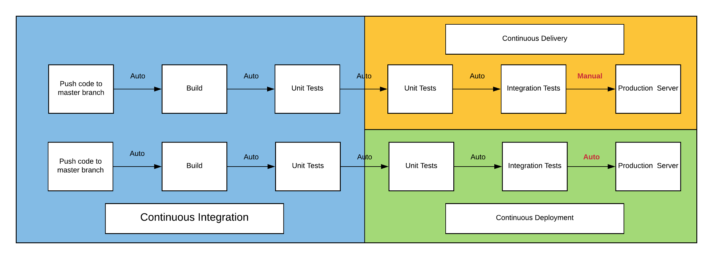

:page-order: 51

= Automation Levels

[quote, Tom Preston-Werner]
You’re either the one that creates the automation or you’re getting automated.

For each of operational task, we could get it done though different level of automation. Depends on the frequency and complicity of the task, we could take a balanced approach. We'd better invest in higher level of automation in frequent repeatable tasks. For lower frequent tasks, we could avoid fully automate the tasks to increase the reliability e.g. domain name registration, better to be in a repeatable operation guide.

[plantuml, automation-leves, png]
----

usecase LEVEL6 as "Level 6
--
Continuous Deployment"

usecase LEVEL5 as "Level 5
--
Continuous Delivery"

usecase LEVEL4 as "Level 4
--
Continuous Integration"

usecase LEVEL3 as "Level 3
--
Scripted Deployment"

usecase LEVEL2 as "Level 2
--
Repeatable Playbook"

usecase LEVEL1 as "Level 1
--
Repeatable Operation Guide"

usecase LEVEL0 as "Level 0
--
No Repeatable Documentation"

LEVEL0 -up-> LEVEL1
LEVEL1 -up-> LEVEL2
LEVEL2 -up-> LEVEL3
LEVEL3 -up-> LEVEL4
LEVEL4 -up-> LEVEL5
LEVEL5 -up-> LEVEL6

----

== Level 0: No Repeatable Documentation

Basically no automation at all. We should avoid leave any task in this category.

== Level 1: Repeatable Operation Guide

Tasks with good documentation:

* Low frequency third party integration tasks
* Starting point for spike activities

== Level 2: Repeatable Playbook

Tasks with `versioned` tools support:

* Low frequent simple infrastructure activities
* Starting point for high frequent activities in a hurry

== Level 3: Scripted Deployment

Complex multi steps tasks:

* High frequent deployment activities
* With simple parameters
* Without code changes

== Level 4: Continuous Integration

Deploy to `CI` environment via git commit trigger:

* For related code base `master` branch

== Level 5: Continuous Delivery

Deploy to `PROD` environment via a manual approval/switch step.

* For related release `release-vX.X.X` branch
* Deploy new release to `pre-production` instance
* Have automated validation on `pre-production` instance
* Have a `switch button` or similar mechanism for controlled release

== Level 6: Continuous Deployment

Deploy to `PROD` environment via git commit trigger:

* For related release `release-vX.X.X` branch
* Deploy new release to `pre-production` instance
* Have automated validation on `pre-production` instance
* Switch `live-production` to `pre-production`
* Mark previous `live-production` as `post-production` for rollback purpose
* Tear down `post-production` after confirm everything is fine

== CI/CD Relationship

Credit to https://medium.freecodecamp.org/how-to-set-up-continuous-deployment-in-your-home-project-the-easy-way-41b84a467eed[freeCodeCamp.org]