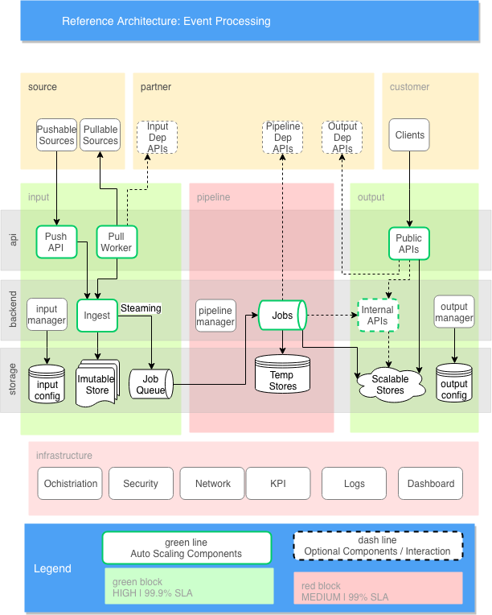
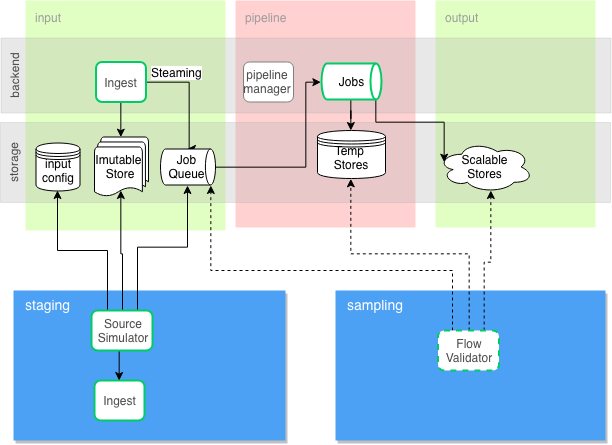

:page-order: 11

= Reference Architecture&#58; Event Processing

[quote, Wikipedia]
A reference architecture is a document or set of documents to which a project manager or other interested party can refer for best practices.

== Realtime Processing

== Use Case: Batch Re-Processing

image::files/reference-architecture-batch.png[Batch Processing]

== Use Case: Pipeline Replication

== Uptime SLA Table

https://en.wikipedia.org/wiki/High_availability#Percentage_calculation[SLA level of uptime/availability] results in the following periods of potential downtime/unavailability:

|===
| Availability % | Downtime / Day | Downtime / Week | Downtime / Month | Downtime / Year

|90% ("one nine")
|2.40 h
|16.80 h
|73.05 h
|36.53 d

| 99% ("two nines")
| 14.40 m
| 1.68 h
| 7.31 h
| 3.65 d

| 99.9% ("three nines")
| 1.44 m
| 10.08 m
| 43.83 m
| 8.77 h

| 99.99% ("four nines")
| 8.64 s
| 1.01 m
| 4.38 m
| 52.60 m

| 99.999% ("five nines")				
| 864.00 ms
| 6.05 s
| 26.30 s
| 5.26 m
|===
